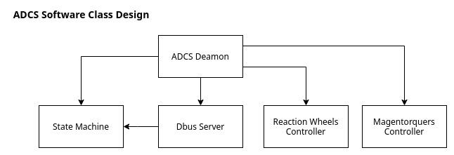

# oresat-adcs-software
Attitude Determination Control System (ADCS). It include GPS, Star Tracker, Magnetorquer, Magnetometer, and Reaction Wheels.


## Dependencies
- cmake
- libsystemd
- pkgconfig
- [armadillo]
- [sdbus-c++]


## Building and running the program
```bash
cd build/
cmake ..
make clean all
./oresat-adcs
```

## State Machine


## Class Design



<!-- links -->
[armadillo]:http://arma.sourceforge.net/
[sdbus-c++]:https://github.com/Kistler-Group/sdbus-cpp
