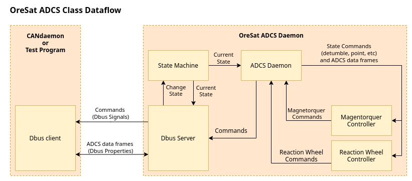

# oresat-adcs-software
Attitude Determination Control System (ADCS). It include GPS, Star Tracker, Magnetorquer, Magnetometer, and Reaction Wheels.

## Dependacies
`python3 python3-pydbus libsystemd-dev`

## Setup
- `sudo cp org.OreSat.ADCS.conf /usr/share/dbus-1/system.d/`

## Usage
- `python3 src/main.py` To run as a process
- `python3 src/main.py -d` To run as a daemon
- `python3 src/main.py -h` For help output

## State Machine

## Class Data Flow

